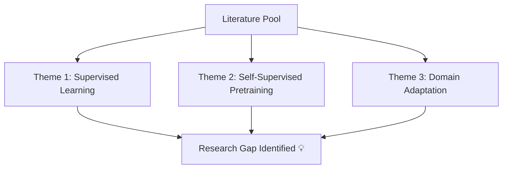

# 📚 Systematic Literature Review Guide

A literature review surveys books, scholarly articles, and any other sources relevant to a particular issue, area of research, or theory.

---

## 🎯 5 Key Steps to a Great Literature Review

### 1. Search for Relevant Literature
Define key terms and boolean operators for database queries:
```text
("transformer models" OR "self-attention") AND ("computer vision" OR "image classification") AND NOT "survey"
```

### 2. Evaluate & Select Sources
Assess paper quality using:
- Citation count & impact factor of journal
- Clarity of methodology & dataset quality
- Recency (last 3-5 years for fast-moving fields like AI)

### 3. Identify Themes, Debates, & Gaps
Organize papers into thematic clusters rather than summarizing paper by paper.



### 4. Outline Your Structure
- **Chronological**: Tracing development over time.
- **Thematic**: Grouping by sub-topic.
- **Methodological**: Grouping by data collection techniques.

### 5. Write Your Review
State the research gap clearly in the final paragraphs to justify your current study!
