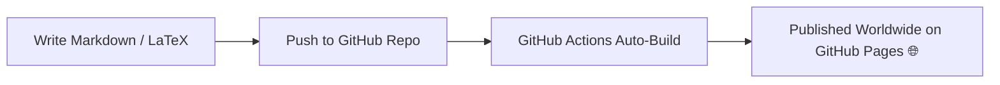

  
💡 Global Access Link

  
Share this portal anywhere in the world! Once GitHub Pages is enabled, your live site URL is:  
  <code>https://sahadatnisad.github.io/reserachhelpbd/</code>

## 📌 Quick Navigation

| Category | Description | Direct Link |
| :--- | :--- | :--- |
| 🛠️ **Research Tools** | Zotero, Mendeley, arXiv, Open Access Databases | [Explore Tools](/research-tools/reference-managers) |
| 🎙️ **Audio Transcription** | Transcribe audio verbatim with Gemini API | [Read Guide](/research-tools/transcribing-verbatim-with-gemini) |
| 📋 **Templates** | Research proposal & paper summary templates | [Get Templates](/templates/research-proposal-template) |

***

### 🌟 How It Works

